<div align="center">
  
</div>

<p align="center">
  <a href="https://ferchgc.netlify.app/"></a>
  <a href="https://www.linkedin.com/in/fernando-luis-gil-correa-143587263/"></a>
  <a href="https://devnull.bond/"></a>
</p>

## `> sobre_mi`

Soy **Ingeniero de Sistemas** y desarrollador backend especializado en **PHP y Laravel**. Construyo aplicaciones web robustas y APIs RESTful eficientes, con foco en soluciones escalables, seguridad y código limpio y bien documentado.

Actualmente cursando la **Especialización Virtual en Ciberseguridad** en la [Corporación Universitaria de Asturias](https://www.uniasturias.edu.co/).

## `> stack`

<p>
  
  
  
  
  
</p>
<p>
  
  
  
  
</p>
<p>
  
  
  
  
  
  
  
</p>

## `> estadisticas`

<p align="center">
  
  
</p>

<p align="center">
  
</p>

## `> estado`

```console
$ cat estado.txt
[+] especialización en Ciberseguridad — UniAsturias (en curso)
[+] profundizando en Laravel
[+] mejorando el diseño de APIs RESTful
[+] aplicando mejores prácticas de seguridad en APIs

$ cat objetivos.txt
[>] contribuir a proyectos open source
[>] especializarme en arquitecturas API-first
[>] subir el nivel en testing y CI/CD
[>] crear apis modernas
```

## `> contribuciones`

<picture>
  <source media="(prefers-color-scheme: dark)" srcset="https://raw.githubusercontent.com/fer-gc05/fer-gc05/output/snake-matrix.svg?v=2">
  <source media="(prefers-color-scheme: light)" srcset="https://raw.githubusercontent.com/fer-gc05/fer-gc05/output/snake-light.svg?v=2">
  
</picture>

## `> certificaciones`

- [](https://coursera.org/share/7a68dbda8b4e06dc383c5cd6f3c3ddec)
- [](https://app.aluracursos.com/program/certificate/0c968ec0-1040-4b42-b690-4148affc6249?lang)
- [-0d1117?style=for-the-badge)](https://wallet.xertify.co/certificates/7C6098E1A002?viewMode=regular)
- [](https://drive.google.com/file/d/18rSvKLAg1F46Fy6naupDMQYMQL9pz13R/view?usp=drive_link)

## `> dato_curioso`

```console
$ cat dato_curioso.txt
PHP significaba "Personal Home Page". Rasmus Lerdorf lo creó en 1994
solo para contar las visitas a su currículum en línea. Hoy significa
"PHP: Hypertext Preprocessor" y mueve una parte enorme de la web.
```

---

<p align="center"><sub><i>"El código limpio no se escribe siguiendo un conjunto de reglas. Escribes tu código primero y después lo limpias." — Robert C. Martin</i></sub></p>
